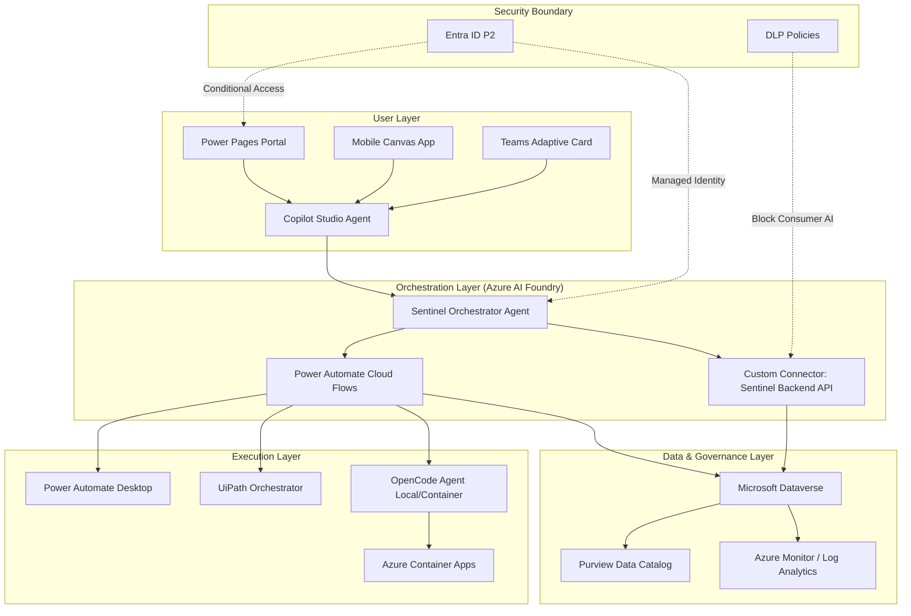

# JABB Sentinel — Reference Architecture

A governed agent mesh: first-party Microsoft surfaces → an Azure AI Foundry orchestrator →
Dataverse system-of-record → governed execution runtimes, all inside an Entra ID + DLP boundary.

## Layers
- **User** — Power Pages (external, Conditional Access), Mobile Canvas (Intune-managed),
  Teams Adaptive Cards; all converge on one governed **Copilot Studio** agent.
- **Orchestration (Azure AI Foundry)** — the **Sentinel Orchestrator** plans/routes,
  authenticating as a workload via **user-assigned Managed Identity**; reaches backend only
  through the certified **Sentinel Backend API** custom connector; deterministic steps run as
  **Power Automate Cloud Flows**.
- **Data & Governance** — **Dataverse** (system of record, row/field security, audit),
  **Azure Monitor/Log Analytics** (telemetry, SIEM feed), **Purview** (classification,
  sensitivity labels, lineage).
- **Execution** — **OpenCode** (private, on **Azure Container Apps** or on-prem), **UiPath**,
  **Power Automate Desktop** — always invoked through governed flows (authorized, logged,
  reversible).
- **Security boundary** — **Entra ID P2** (Managed Identity, Conditional Access, PIM) and
  **DLP** that blocks consumer AI and separates business vs. non-business connectors.

See **[enterprise.md](enterprise.md)** for GRC/control mapping and **[LocalStack.md](LocalStack.md)** for the free local edition.
